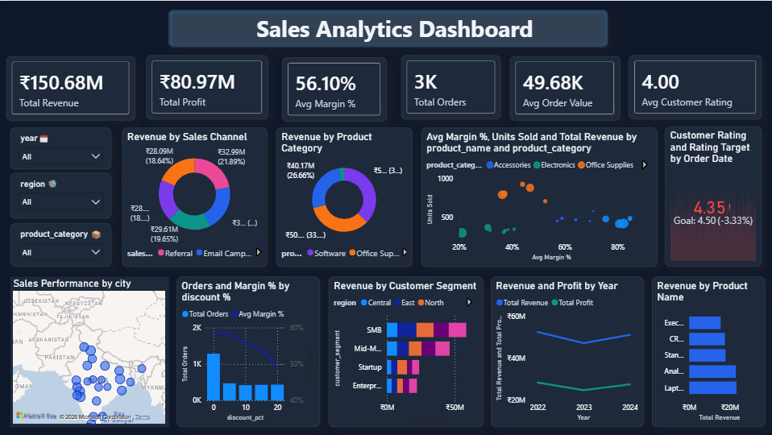

# 📊 Sales Performance Analytics Dashboard

[](https://www.python.org/)
[](data/sql/sales_analysis.sql)
[](reports/powerbi_guide/POWERBI_BUILD_GUIDE.md)
[](reports/excel/Sales_Performance_Analytics.xlsx)

An end-to-end sales analytics project covering data generation, SQL querying, Python EDA, an Excel reporting workbook, an interactive HTML dashboard, and a Power BI build guide — built to demonstrate a complete analytics workflow from raw data to executive-ready insights.

## Dashboard Preview
---

## 🎯 Project Overview

This project simulates a realistic B2B sales operation across 5 regions, 4 product categories, 15 sales reps, and 3 years of transaction history (2022–2024). It answers the core business questions a sales analytics function is expected to address:

- How is revenue and profit trending over time, and is there seasonality?
- Which products, regions, and reps are driving (or dragging) performance?
- How do customer segments and sales channels differ in value?
- What is the real cost of discounting on margin?

## 🛠️ Tech Stack


| Layer                   | Tools                                                                    |
| ----------------------- | ------------------------------------------------------------------------ |
| Data Generation         | Python (pandas, numpy)                                                   |
| Data Storage & Querying | SQL (sales_orders schema)                                                |
| Exploratory Analysis    | Python (pandas, matplotlib, seaborn) — Jupyter Notebook                 |
| Reporting Workbook      | Excel (openpyxl) — 8-sheet workbook with charts, conditional formatting |
| BI Dashboard            | Power BI (build guide + DAX measures included)                           |
| Web Dashboard           | HTML + Chart.js (interactive, browser-based)                             |

## 📁 Project Structure

```
Sales-Performance-Analytics/
├── data/
│   ├── raw/
│   │   └── sales_raw.csv                 # 5,000 raw transactions (incl. cancelled/returned)
│   ├── processed/
│   │   ├── sales_cleaned.csv             # Completed orders only — analysis-ready
│   │   ├── regional_summary.csv
│   │   ├── product_summary.csv
│   │   ├── monthly_trend.csv
│   │   └── rep_leaderboard.csv
│   ├── sql/
│       └── sales_analysis.sql            # 18 queries: KPIs, trends, rankings, cohorts
├── notebooks/
│   └── sales_analysis.ipynb              # Full EDA: trends, products, regions, reps, segments
├── reports/
│   ├── excel/
│   │   └── Sales_Performance_Analytics.xlsx   # 8-sheet workbook (Dashboard, Raw Data, etc.)
│   └── pbix_dashboard/
│       └── sales_Performance_Analytics_Dashboard.pbix          # Interactive dashboard 
├── assets/
│   └── images/                           # Charts exported from the notebook (PNG)
├── docs/
│   └── DATA_DICTIONARY.md                # Column definitions and business logic
├── requirements.txt
├── .gitignore
└── README.md
```

## 📈 Key Insights

- **Revenue is stable** at ₹83–85M/year with a consistent **Q4 seasonal peak** (festive demand, +15–25%)
- **Software has the highest gross margin** (~60–70%) despite contributing less volume than Electronics
- **West region leads** in total revenue; **Central region** has the strongest margin discipline
- **SMB customers drive order volume** (~40% of orders) while **Enterprise accounts deliver the highest AOV**
- **Discounts above 15%** materially erode margin — orders at 20% discount average ~22% margin vs 45%+ at full price
- Only **61% of raw orders reach Completed status** — return/cancellation analysis is a clear next step

Full breakdown in [`reports/excel/Sales_Performance_Analytics.xlsx`](reports/excel/Sales_Performance_Analytics.xlsx) → *Insights* sheet, and in the notebook's final section.

## 🚀 How to Run

### 1. Clone & install dependencies

```bash
git clone https://github.com/Shruti-jangir/Sales-Performance-Analytics.git
cd Sales-Performance-Analytics
pip install -r requirements.txt
```

### 2. Load the Dataset

The dataset is already included in this repository.

Use the following file to begin your analysis:

```text
data/raw/sales_raw.csv
```

### 3. Run the analysis notebook

```bash
cd ../notebooks
jupyter notebook sales_analysis.ipynb
```

### 4. Explore the SQL queries

Load `data/processed/sales_cleaned.csv` into any SQL engine (PostgreSQL, MySQL, SQLite) using the schema in `data/sql/sales_analysis.sql`, then run the included queries.

### 5. Open the Excel workbook

Open `reports/excel/Sales_Performance_Analytics.xlsx` — no setup needed, all charts and formatting are pre-built.

### 6. View the interactive HTML dashboard

Simply open `reports/html_dashboard/sales_dashboard.html` in any browser — fully self-contained, no server required.

### 7. Build the Power BI dashboard

Follow `reports/powerbi_guide/POWERBI_BUILD_GUIDE.md` for a full step-by-step walkthrough, including all DAX measures used.

## 📊 Dataset Summary


| Metric             | Value                                                   |
| ------------------ | ------------------------------------------------------- |
| Total Transactions | 5,000 (3,033 completed)                                 |
| Date Range         | Jan 2022 – Dec 2024                                    |
| Regions            | 5 (North, South, East, West, Central)                   |
| Product Categories | 4 (Electronics, Software, Office Supplies, Accessories) |
| Sales Reps         | 15                                                      |
| Unique Customers   | 95                                                      |
| Total Revenue      | ₹150.7M                                                |
| Total Gross Profit | ₹81.0M                                                 |

> Note: all data is **synthetically generated** (seeded for reproducibility) to demonstrate analytical technique without using proprietary business data.

## 🔗 Links

- **GitHub**: [Shruti-jangir](https://github.com/Shruti-jangir)
- **Email**: (shrutijangir46@gmai.com)
---

*Built by Shruti Jangir — B.Tech CSE (Data Science), CMR University, Bengaluru*
